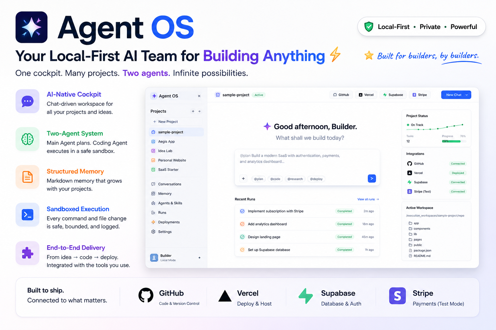
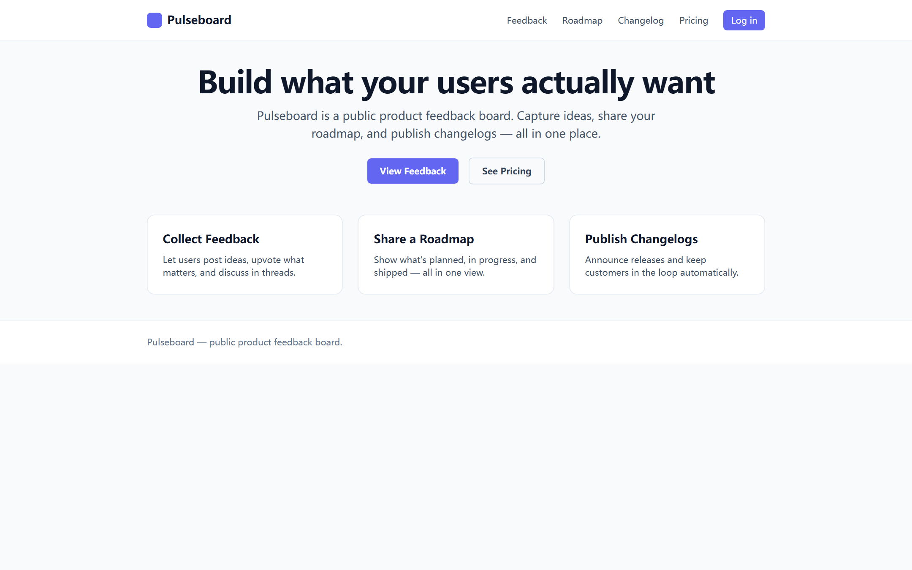
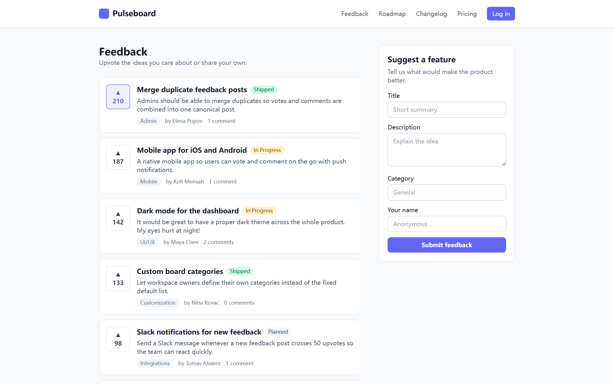
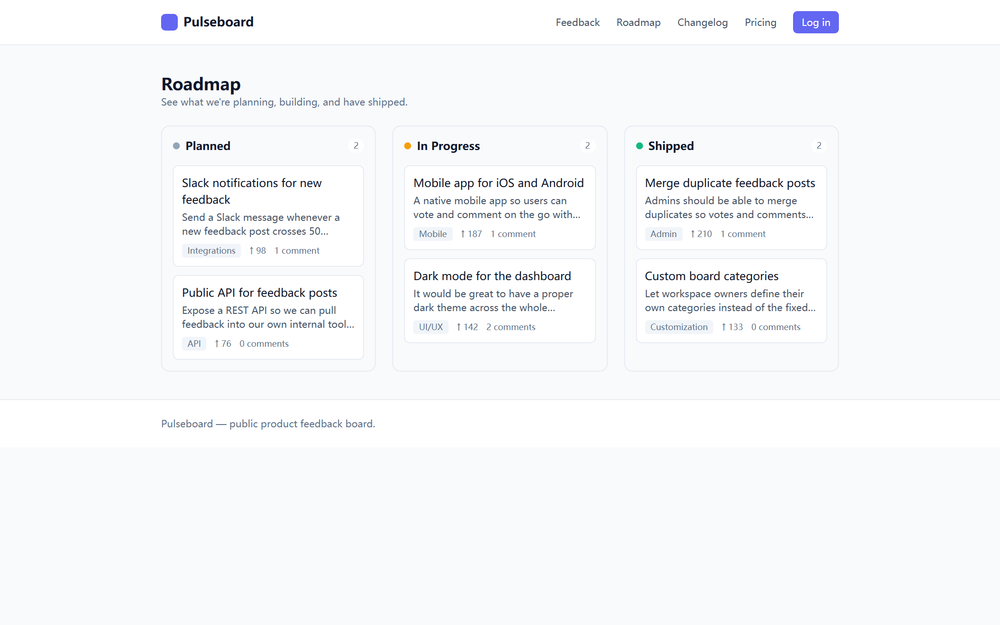
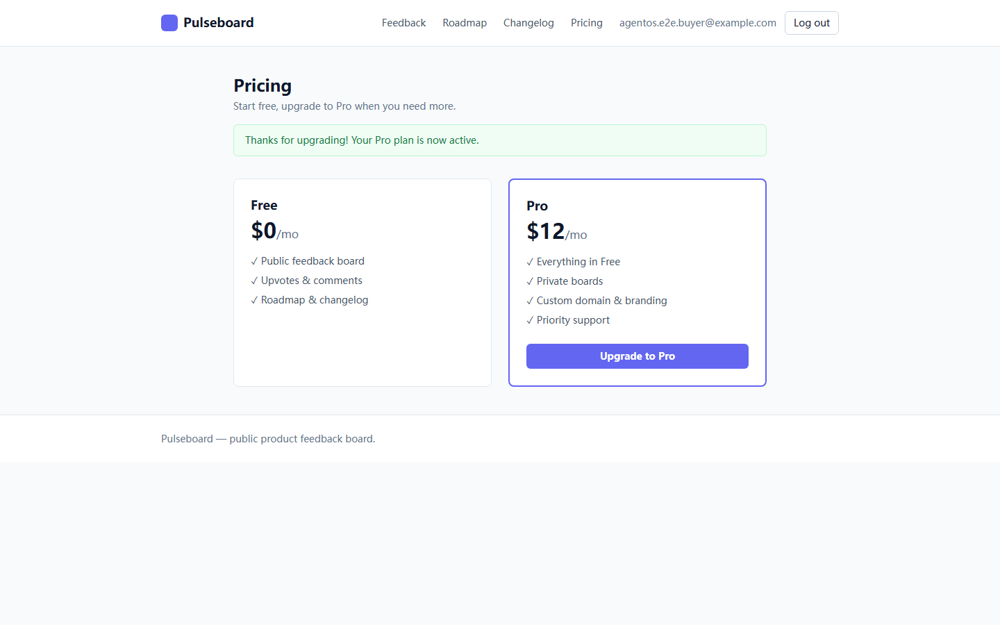
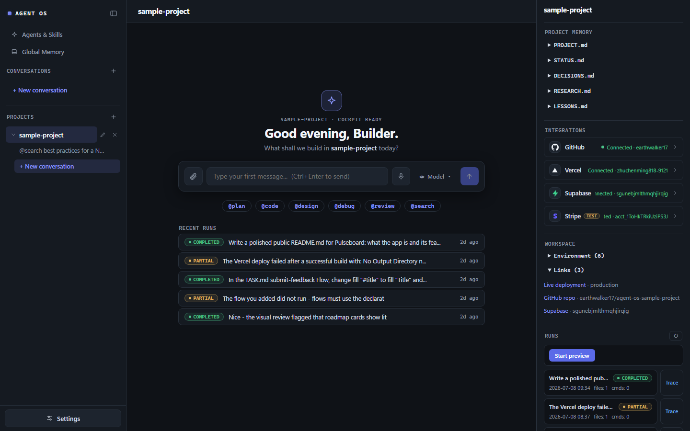
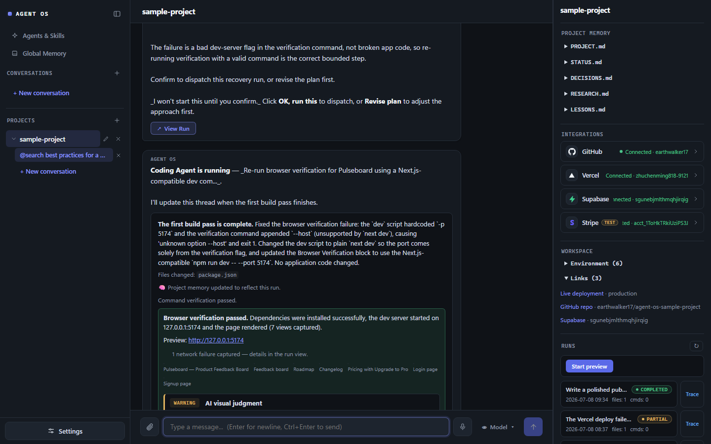
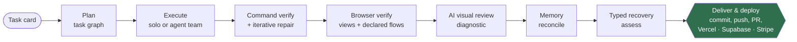

<div align="center">

# Agent OS

### A local-first AI Project Operating System — the *harness* that turns a coding model into a reliable software agent.



**`LLM + Harness = Agent`**

[](https://github.com/earthwalker17/agent-os/actions/workflows/ci.yml)
[](https://github.com/earthwalker17/agent-os/releases/latest)
[](./LICENSE)


</div>

> **Docs map.** This README is the public landing page. The system's shape (files,
> pipelines, invariants) lives in [`ARCHITECTURE.md`](./ARCHITECTURE.md); the evolution
> log in [`ROADMAP.md`](./ROADMAP.md); the long-term direction in
> [`BLUEPRINT.md`](./BLUEPRINT.md); the operating guide for coding agents working
> on this repo in [`CLAUDE.md`](./CLAUDE.md).

---

## What is Agent OS?

**Agent OS is a local-first cockpit for running multiple long-term software projects through a single web chat surface** — and the *harness* that wraps a coding model with everything it needs to finish real work reliably.

It runs entirely on your machine — **filesystem + SQLite + FastAPI + React**, no cloud queues, no hidden infrastructure — and combines:

- **Project-scoped conversations** — each project has its own chat history, memory, and execution workspace, isolated from the others.
- **Structured markdown memory** — durable project state lives in readable, editable `.md` files, not buried in chat scrollback.
- **A two-agent split** — a **Main Agent** (the brain: planner, memory steward, orchestrator) and a sandboxed **Coding Agent** (the hands: a bounded executor inside one project's workspace).
- **A capability-aware provider registry** — six model providers (**Claude, GPT, Gemini, DeepSeek, Kimi, Zhipu GLM**), each with a selectable model list and vision metadata.
- **A full build → verify → deliver → deploy loop** — plan into a task graph, execute (in parallel agent teams when safe), verify with a real build, walk the running app in a headless browser, review it with a vision model, deliver through audited Git/GitHub contracts, and ship it to production through Vercel / Supabase / Stripe-test connectors — every external or destructive step behind an explicit human approval gate.
- **Self-healing that stays on a leash** — a typed Recovery Matrix classifies failures, packages the evidence, and (only with your pre-approved budget) runs bounded, fully-audited repair passes.
- **Discoverable agents, skills & approval-first research** — an `@`-command palette backed by structured agent contracts and editable skill files; a `@search` research channel that fetches bounded, cited web sources only on your explicit command; and bounded local retrieval over a project's own memory, runs, and repo.

It is deliberately *not* a general-purpose assistant or a heavyweight agent platform. It's a clear, controllable place for one builder to plan, decide, and execute project work — with the model on a leash that makes its output trustworthy.

---

## Why an Agent Harness matters

A foundation model that can generate code is necessary but not sufficient. The gap between *"the model produced a diff"* and *"the task is reliably done"* is filled by the harness:

| The model gives you… | …but reliable execution also needs |
|----------------------|------------------------------------|
| A plausible diff | **Verification** that the change actually builds and renders — ground truth, not the model's say-so |
| A single-shot answer | **Memory** that persists project state across turns and runs |
| Raw tool-call intent | A **sandbox chokepoint** so every file write and shell command is validated and bounded |
| An opaque "done" | **Observable artifacts** — task card, plan, event log, result, screenshots, diff — you can replay |
| Confident hallucination | **Bounded repair loops** and a typed **recovery matrix** that catch and correct failure |
| Eagerness to act | **Permission gates** so nothing pushes code, mutates external systems, or spends money without explicit approval |
| A code change | **Delivery** — checkpoint, reviewed diff, commit, push, PR, deployment, migration — with full traceability |

Agent OS is an attempt to build that harness end-to-end, with the boundaries and audit trail treated as constitutional rather than optional.

---

## Showcase: a production SaaS Agent OS shipped by itself

[**Pulseboard**](https://github.com/earthwalker17/agent-os-sample-project) — live at [**agent-os-sample-project.vercel.app**](https://agent-os-sample-project.vercel.app) — is a public product-feedback & roadmap SaaS: feedback posts with upvotes and comments, a Planned / In Progress / Shipped roadmap, a changelog, Supabase auth + Postgres + RLS, and a Stripe test-mode Pro subscription. Agent OS planned it, built it, verified it, **repaired it when things broke**, and shipped it **from an empty repository to a paying production deployment** — driven only by short chat messages, with a human doing nothing but approving contracts.

| | |
|---|---|
|  |  |
|  |  |

Everything ran through Agent OS itself, the way a user would drive it:

- **Planned & built.** A natural-language product request became a judged, confirmable plan, then a multi-task Coding Agent run; a real `npm run build` gated completion (the model can't mark its own homework).
- **Browser-verified, interactively.** Headless Chromium walked 8 rendered pages and executed the declared `submit-feedback` flow — goto → fill → submit → assert — with per-step screenshots. The AI visual review caught a real rendering bug (roadmap upvote arrows showing literal `↑` escape text); after a fix run, the verdict flipped to `passed`.
- **Self-healed.** A bad dev-server flag broke browser verification. The typed Recovery Matrix classified the failure `runtime`, packaged the actual stderr into a confirmable repair plan, and the repair child fixed the config — budget-clamped to one pass, fully linked parent↔child lineage, all audited.
- **Delivered through contracts.** Two-phase preview→confirm all the way: Git commit → push to [its own repo](https://github.com/earthwalker17/agent-os-sample-project), Vercel **production** deploy (READY), Supabase link + SQL migration (tables + RLS verified live), Stripe test-mode product/price provisioning + signed webhook registration, and per-key env-var pushes — every step recorded in the project's `OPS.md` ledger.
- **Proven in production.** A real signup on the live site, a real Stripe test checkout, and the signed `checkout.session.completed` webhook flipping `profiles.plan` to `"pro"` in the live Postgres — confirmed by reading the row back. The full payment→persistence loop, on the deployed app.

And this is the cockpit itself — the new-conversation landing (left) and a live run inside the chat thread (right), with reconciled project memory, the provider integrations, and the Git/connector state in the context panel. Shown in dark mode; a light theme ships too.

| | |
|---|---|
|  |  |

---

## Architecture overview

```
┌────────────┐   /api   ┌──────────────────┐        ┌─────────────────────────────┐
│  Frontend  │ ←──────→ │  FastAPI backend │ ←────→ │  Provider Registry          │
│  React/TS  │          │   (main.py)      │        │  Claude · GPT · Gemini ·    │
└────────────┘          └────────┬─────────┘        │  DeepSeek · Kimi · GLM      │
                                 │                  └─────────────────────────────┘
        ┌────────────────────────┼────────────────────────────┐
        ▼                        ▼                            ▼
   memory/                projects/{id}/          execution_workspaces/{id}/
   (global .md)           (project .md)           ├─ repo/    ← Coding Agent's sandbox
        │                       │                 ├─ runs/    ← per-run artifacts
        └─── Main Agent ────────┘                 ├─ patches/ ← team-run isolation
             (chat brain)                         └─ (runner + verify + git + deploy)
```

### Brain vs. hands — the central rule

- **Main Agent = brain.** Holds the conversation, loads global + project memory, assembles context, produces planning / explanation / review replies, decides delegation, and reconciles memory. **It never edits `repo/` code and never runs a shell command.** It can read specific repo files *on demand* through a bounded, read-only inspection channel — but repo contents are **never auto-injected** into its context.
- **Coding Agent = hands.** A bounded JSON tool loop inside exactly one project's `execution_workspaces/{id}/repo/`. It edits code through six sandboxed tools and produces run artifacts. **It never edits memory and never touches another project's workspace.**

They communicate through **summaries, not shared context** — a boundary that is load-bearing for the whole design.

### The sandbox chokepoint

Every repo path and every shell command routes through **one** boundary: `ProjectSandbox` → `ToolRuntime`. There is no raw `os` / `pathlib` / `subprocess` access to repo paths anywhere else. The Coding Agent gets exactly six tools — `list_files`, `read_file`, `write_file`, `append_file`, `search_files`, `run_shell` — each with bounded output. Git and the Supabase CLI are separate audited executors, **not** agent tools, and `run_shell` blocks `git push` and destructive commands.

---

## The run lifecycle: build → verify → deliver → deploy

A single natural-language task card flows through a phased, auditable pipeline. Each stage leaves a durable artifact, and each external/destructive stage is gated behind explicit approval.



- **Explicit dispatch only.** Only `@code <task>` or clicking **OK, run this** on a model-proposed plan starts a run. Inferred intent never auto-runs code; the one scoped exception is a bounded auto-recovery budget you pre-approve at confirm time.
- **Verification is the ground truth for "done."** A run is `completed` only after a real build/test passes — not because the model claimed success.
- **Best-effort tail.** Verification, browser checks, reconciliation, and diff capture never crash a run and never leave it stuck.

---

## What's inside

| Capability | What it does |
|------------|--------------|
| **Project cockpit** | Three-column React UI (projects / chat / context + runs) with light/dark themes, editable memory files, a live Runs panel, and a multi-modal composer (voice, attachments, `@`-command palette). |
| **Main Agent orchestration** | Context assembly from memory, deterministic `@`-modes (`@plan` `@design` `@debug` `@review` `@inspect` `@memory`), a model-judged delegation classifier that only ever *proposes*, and bounded on-demand file inspection. |
| **Memory engine** | One atomic, policy-filtered markdown write path; a structured intake judge proposes updates after each turn; post-run reconciliation folds run outcomes into project status. |
| **Coding Agent runner** | Phased runs: plan (read-only inspection → task graph) → execute (solo, sequential, or **parallel agent teams** in isolated patch workspaces with deterministic integration) → finalize, with live metrics and a full event trace. |
| **Verification** | Inferred or declared command verification (real `npm run build` / `pytest`) with a bounded iterative repair loop; a run is `completed` only when the build is green. |
| **Browser verification + visual review** | Headless Playwright walks the running app — render-readiness-gated multi-page captures plus **declared interaction flows** (click / fill / submit / expect_text, bounded and same-origin) with per-step screenshots, console/network evidence, and a diagnostic vision-model verdict. |
| **Typed recovery** | A Recovery Matrix classifies every failure (build / runtime / visual / integration / deployment / database / product / docs), packages redacted evidence into the repair card, and honors a user-granted, contract-clamped auto-recovery budget (≤2). |
| **Git/GitHub delivery** | Automatic pre-run checkpoint + redacted post-run diff, then explicit two-phase commit / push / PR / rollback contracts. Tokens reach git only via a push-time `GIT_ASKPASS` env — never argv, config, logs, or the UI. |
| **Production connectors** | Vercel deploy/redeploy/rollback, Supabase link + migrations (sandboxed CLI), Stripe **test-mode** checkout + webhooks, and a presence-only env registry — all preview→confirm contracts, all redacted, all recorded in a deterministic `OPS.md` ledger. |
| **Research & skills** | Grant-gated `@search` web research (SSRF-screened, allowlisted, cited, egress-guarded), bounded local RAG over memory/runs/repo, 18 editable agent skills, and review-first skill-patch proposals after green runs. |

**Test coverage:** **820+ backend tests** across 59 files, each runnable standalone. Every test **stubs the LLM caller**, so the full suite runs with no API key. Frontend `npm run build` (tsc + vite) is green.

---

## Quick start

### One-command install (Windows)

Open PowerShell and run:

```powershell
irm https://raw.githubusercontent.com/earthwalker17/agent-os/main/install.ps1 | iex
```

The installer checks (and offers to install) Git, Python 3.10+, and Node.js 18+, clones the repo, installs backend + frontend dependencies and the Playwright browser, and creates your `.env` from the template. Then:

1. Open `backend\.env` and add at least one model provider key (`ANTHROPIC_API_KEY` recommended).
2. Start everything: `.\start.ps1`
3. Open <http://localhost:5173>.

### Manual setup (any platform)

```bash
# Backend
cd backend
pip install -r requirements.txt
python -m playwright install chromium   # browser verification
cp .env.example .env                    # then add at least one provider key
uvicorn main:app --reload --port 8000

# Frontend (second terminal)
cd frontend
npm install
npm run dev
```

Open <http://localhost:5173>. (Verified preview apps use port **5174** so they never collide with Agent OS itself.)

### Configuration

`backend/.env` holds **global** keys: model providers (Claude / GPT / Gemini / DeepSeek / Kimi / GLM), `TAVILY_API_KEY` for `@search`, and account-level connector tokens (`GITHUB_TOKEN`, `VERCEL_TOKEN`, `SUPABASE_ACCESS_TOKEN`, `STRIPE_SECRET_KEY` — test-mode). Per-project settings (which GitHub repo, Vercel project, Supabase ref/password, …) are set in the UI and live in the gitignored `credentials/` store. Secrets never appear in prompts, logs, artifacts, memory, Git, or the UI.

### Running the tests

```bash
cd backend
python -m pytest tests -q     # full suite, no API key needed
python tests/test_sandbox_git.py   # or any file standalone
```

---

## Verification & safety

Reliability and safety are enforced by the harness, not requested of the model:

- **Command verification + bounded repair** gate every `completed` status on a real build.
- **Browser verification** captures the actually-running app — never a loading spinner — and executes only **declared, bounded** interaction flows (no arbitrary browsing, no credential input).
- **One sandbox chokepoint** validates every path and command; destructive shell and Git are blocked; parallel team writers work in isolated patch workspaces with deterministic, conflict-surfacing integration.
- **Credential hygiene**: one secret reader (`credentials.py`), presence-only status, exact-value + pattern redaction on every artifact, tokens delivered only via headers or exec-time env, secret-refusing commits, and an egress guard on the research channel.
- **Human-in-the-loop delivery**: push, PR, rollback, deploys, migrations, and payments setup are two-phase preview→confirm contracts. There is no inferred-intent path to any external mutation.

---

## Repository layout

```
agent-os/
├── install.ps1 / start.ps1   # Windows one-command installer + launcher
├── frontend/                 # React + Vite + TypeScript UI
├── backend/                  # Python + FastAPI
│   ├── main.py               # API endpoints
│   ├── orchestrator.py       # context assembly + judges + inspect/research loop
│   ├── providers.py          # six-provider model registry
│   ├── memory_engine.py      # the single atomic markdown write path
│   ├── credentials.py        # the only secret reader
│   ├── execution/            # sandbox, runner, teams, verification, browser,
│   │                         #   git, connectors, recovery
│   └── tests/                # 820+ backend tests (LLM stubbed)
├── memory/                   # global markdown memory (private; templates ship)
├── projects/                 # per-project memory (private; templates ship)
├── execution_workspaces/     # Coding Agent workspaces (private; templates ship)
├── skills/                   # committed, user-editable agent skills
└── docs/images/              # README screenshots
```

---

## Roadmap

| Phase | Theme | Status |
|------:|-------|:------:|
| 1–2 | Workspace, markdown memory, LLM orchestration + semantic writeback | ✅ |
| 3 | Execution layer — sandbox, runner, delegation, verification | ✅ |
| 4 | Interface & UX — multi-modal composer, Provider Registry 2.0, themes | ✅ |
| 5 | Execution orchestration — plan → task graph → execute, live trace | ✅ |
| 6 | Main Agent v2 — memory engine, intent router, confirmable recovery | ✅ |
| 7 | Project Ops — Git/GitHub lifecycle behind approval contracts | ✅ |
| 8 | Production path — Vercel + Supabase + Stripe-test connectors (validated live) | ✅ |
| 9 | Agent teams — parallel execution in isolated workspaces + integration | ✅ |
| 10 | Research / RAG / skills — grant-gated web research, local retrieval | ✅ |
| 11 | Self-healing — typed Recovery Matrix + interactive browser verification | ✅ |
| 12 | Launch / Growth Studio — diagrams, demo kits, release assets | ⏳ planned |

The full evolution log lives in [`ROADMAP.md`](./ROADMAP.md); the long-term direction in [`BLUEPRINT.md`](./BLUEPRINT.md).

---

## Contributing & community

Agent OS is open source under the [Apache 2.0 License](./LICENSE). Contributions that respect its local-first, sandboxed, approval-gated design are welcome.

- **[Contributing guide](./CONTRIBUTING.md)** — dev setup, running the checks, and the pull-request process.
- **[Security policy](./SECURITY.md)** — report vulnerabilities privately through GitHub, never in a public issue.
- **[Code of Conduct](./CODE_OF_CONDUCT.md)** · **[Changelog](./CHANGELOG.md)** · **[Discussions](https://github.com/earthwalker17/agent-os/discussions)**

---

<div align="center">

**Agent OS** · local-first · auditable · multi-provider · `LLM + Harness = Agent`

</div>
