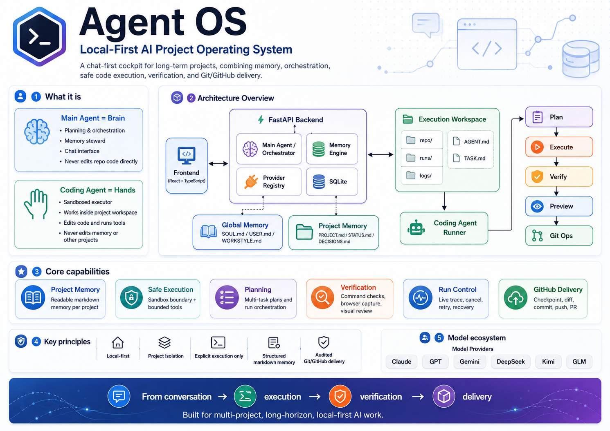
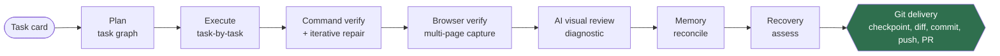
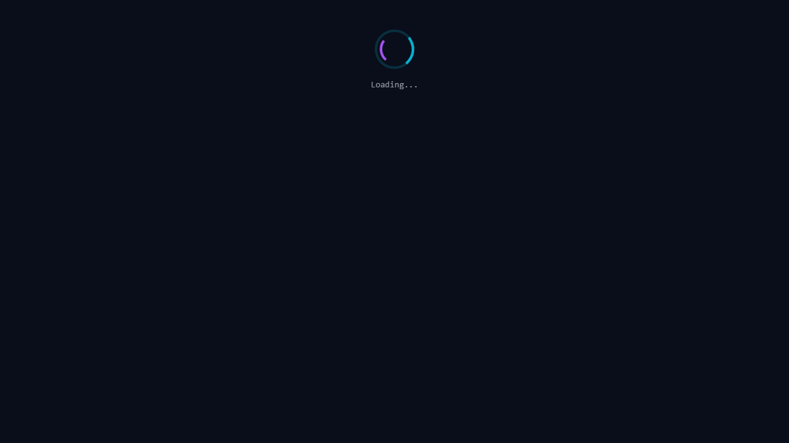

<div align="center">

# Agent OS

### A local-first AI Project Operating System — the *harness* that turns a coding model into a reliable software agent.



**`Model + Harness = Agent`**

Once a foundation model can write code, the hard part is everything *around* the model: project memory, context engineering, sandboxed tools, verification, observability, recovery, and audited delivery. **Agent OS is that harness** — and its sandboxed agent has already planned and built a full-stack app from an empty repository, gated by a real production build ([see the showcase](#showcase-a-full-stack-app-agent-os-built-by-itself)).


</div>

> **Docs map.** This README is the public landing page. The system's shape (files,
> pipelines, invariants) lives in [`ARCHITECTURE.md`](./ARCHITECTURE.md); the status,
> task log, and roadmap in [`ROADMAP.md`](./ROADMAP.md); the long-term direction in
> [`BLUEPRINT.md`](./BLUEPRINT.md); the operating guide for any coding agent working
> on the repo in [`CLAUDE.md`](./CLAUDE.md).

---

## What is Agent OS?

**Agent OS is a local-first cockpit for running multiple long-term software projects through a single web chat surface** — and the *harness* that wraps a coding model with everything it needs to finish real work reliably.

It runs entirely on your machine — **filesystem + SQLite + FastAPI + React**, no cloud queues, no hidden infrastructure — and combines:

- **Project-scoped conversations** — each project has its own chat history, memory, and execution workspace, isolated from the others.
- **Structured markdown memory** — durable project state lives in readable, editable `.md` files, not buried in chat scrollback.
- **A two-agent split** — a **Main Agent** (the brain: planner, memory steward, orchestrator) and a sandboxed **Coding Agent** (the hands: a bounded executor inside one project's workspace).
- **A capability-aware provider registry** — six model providers (**Claude, GPT, Gemini, DeepSeek, Kimi, Zhipu GLM**), each with a selectable model list and vision metadata.
- **A full build → verify → preview → deliver loop** — plan into a task graph, execute task-by-task, verify with a real build, screenshot the running app, review it with a vision model, and deliver through audited Git/GitHub contracts — every external or destructive step behind an explicit human approval gate.

It is deliberately *not* a general-purpose assistant or a heavyweight agent platform. It's a clear, controllable place for one builder to plan, decide, and execute project work — with the model on a leash that makes its output trustworthy.

---

## Why an Agent Harness matters

A foundation model that can generate code is necessary but not sufficient. The gap between *"the model produced a diff"* and *"the task is reliably done"* is filled by the harness:

| The model gives you… | …but reliable execution also needs |
|----------------------|------------------------------------|
| A plausible diff | **Verification** that the change actually builds and renders — ground truth, not the model's say-so |
| A single-shot answer | **Memory** that persists project state across turns and runs |
| Raw tool-call intent | A **sandbox chokepoint** so every file write and shell command is validated and bounded |
| An opaque "done" | **Observable artifacts** — task card, plan, event log, result, screenshots, diff — you can replay |
| Confident hallucination | **Bounded repair loops** and a **recovery** assessor that catch and correct failure |
| Eagerness to act | **Permission gates** so nothing pushes code, mutates external systems, or runs destructive commands without explicit approval |
| A code change | **Delivery** — checkpoint, reviewed diff, commit, branch, push, and PR, with full run↔commit↔PR traceability |

Agent OS is an attempt to build that harness end-to-end, with the boundaries and audit trail treated as constitutional rather than optional.

---

## Architecture overview

```
┌────────────┐   /api   ┌──────────────────┐        ┌─────────────────────────────┐
│  Frontend  │ ←──────→ │  FastAPI backend │ ←────→ │  Provider Registry          │
│  React/TS  │          │   (main.py)      │        │  Claude · GPT · Gemini ·    │
└────────────┘          └────────┬─────────┘        │  DeepSeek · Kimi · GLM      │
                                 │                  └─────────────────────────────┘
        ┌────────────────────────┼────────────────────────────┐
        ▼                        ▼                            ▼
   memory/                projects/{id}/          execution_workspaces/{id}/
   (global .md)           (project .md)           ├─ repo/    ← Coding Agent's sandbox
        │                       │                 ├─ runs/    ← per-run artifacts
        └─── Main Agent ────────┘                 ├─ logs/  AGENT.md  TASK.md
             (chat brain)                         └─ (runner + verify + preview + git)
```

The hero image at the top is the full system map. The moving parts — each covered in depth in [Core modules](#core-modules--capabilities) below — are:

- **Project-scoped conversations** — isolated chat, memory, and workspace per project.
- **Structured markdown memory** — durable state in editable `.md` files, policy-filtered on write.
- **Provider registry** — six selectable model providers, each with vision metadata.
- **Sandboxed execution** — the Coding Agent's planning → task-graph → execute loop.
- **Verification & browser preview** — real build/test gating, a headless render capture, and a vision-model review.
- **Run artifacts & traces** — every run replayable from committed evidence.
- **Git/GitHub delivery** — audited checkpoint → diff → commit → push → PR, each behind a confirmation gate.

The two boundaries below are the load-bearing ones.

### Brain vs. hands — the central rule

- **Main Agent = brain.** Holds the conversation, loads `SOUL.md` + global + project memory, assembles context, produces planning / explanation / review replies, decides delegation, and reconciles memory. **It never edits `repo/` code and never runs a shell command.** It can read specific repo files *on demand* through a bounded, read-only inspection channel (max 3 reads per turn) — but repo contents are **never auto-injected** into its context.
- **Coding Agent = hands.** A bounded JSON tool loop inside exactly one project's `execution_workspaces/{id}/repo/`. It edits code through six sandboxed tools and produces run artifacts. **It never edits memory or touches another project's workspace.**

They communicate through **summaries, not shared context** — a boundary that is load-bearing for the whole design.

### The sandbox chokepoint

Every repo path and every shell command routes through **one** boundary: `ProjectSandbox` → `ToolRuntime`. There is no raw `os` / `pathlib` / `subprocess` access to repo paths anywhere else. The Coding Agent gets exactly six tools — `list_files`, `read_file`, `write_file`, `append_file`, `search_files`, `run_shell` — each with bounded output. Git is a separate audited executor (`ToolRuntime.run_git`), **not** an agent tool, and `run_shell` blocks `git push` and destructive Git.

---

## Core modules & capabilities

Everything in this table is **implemented and tested** today.

| Module | What it does |
|--------|--------------|
| **Project cockpit** | Three-column React UI (projects / chat / context + runs). Project- and conversation-scoped chat, editable memory files, a live Runs panel, and a multi-modal composer (multiline input, voice dictation, file attachments). |
| **Main Agent orchestration** | Context assembly from memory, an **intent router** (`@plan` / `@design` / `@debug` / `@review` / `@inspect` / `@memory` modes), a model-judged **delegation** classifier, and an on-demand bounded file-inspection loop. |
| **Memory engine** | A single atomic, policy-filtered markdown write path. After each turn a structured **memory-intake** judge proposes updates; the backend validates them against a writable-file set before touching disk. `SOUL.md` is read-only and never written. |
| **Provider Registry 2.0** | Capability-aware registry of six providers, each with a selectable model list, per-model `vision` flags, env-overridable defaults, and key-presence availability. Anthropic via SDK; the rest via OpenAI-compatible / REST `urllib` calls — **no extra SDK dependencies**. |
| **Coding Agent runner** | A phased run: **plan** (read-only inspection → task graph) → **execute** (task-by-task in topological order) → **finalize**. Records per-task status / files / commands / blockers; metrics climb **live** during the run. |
| **ToolRuntime / Sandbox** | The six sandboxed file/shell tools + `ProjectSandbox` path and command validation — the one boundary all execution passes through. |
| **Command verification** | Infers the right checks from the repo (`npm run build`, `pytest` *iff* importable, else a `compileall` syntax check) or honors a manual `## Verification` block, runs them, and on failure gives the agent a **bounded iterative repair loop** (up to 5 passes) that re-reads the erroring files and re-verifies. A run is `completed` only after verification passes. |
| **Browser verification + visual review** | Spins up the dev server, **waits for a genuine render** (not a loading spinner), captures the entry page plus a few discovered views via headless Playwright, then has a **vision model review** the screenshots (`passed` / `warning` / `failed` / `inconclusive`). Diagnostic-only — it never gates run status — and skips gracefully without a vision-capable model. |
| **Run trace / observability** | Every run emits `task_card.md`, `plan.json`, `events.jsonl`, `run.json`, `result.md`, `diff.patch`, and screenshots. The UI shows a **live phase badge + task checklist**, a settled **timeline**, and a granular **Live Trace** (every file op and command, polled; chain-of-thought dropped). |
| **Recovery / retry / cancel** | Runs can be **cancelled** cooperatively and **retried** as a fresh linked run. A non-green run gets a best-effort **recovery assessment** → one bounded, confirmable next step. With explicit user approval, a bounded **auto-recovery budget** (≤ 2) lets a run self-heal — capped, linked, and fully audited. |
| **Project Ops & GitHub delivery** | Automatic pre-run **checkpoint** + redacted post-run **diff**, then explicit two-phase **commit / push / PR / rollback** contracts. GitHub tokens reach git only via a push-time `GIT_ASKPASS` env — never in argv, `.git/config`, commits, logs, memory, or the UI. |

---

## The run lifecycle: build → verify → preview → deliver

A single natural-language task card flows through a phased, auditable pipeline. Each stage leaves a durable artifact, and each external/destructive stage is gated behind explicit approval.



- **Best-effort tail.** Verification, browser checks, reconciliation, checkpoint, and diff capture **never crash finalization** and never leave a run stuck in `running`.
- **Explicit dispatch only.** Only `@code <task>` or confirming a model-proposed plan starts a run. Inferred intent never auto-runs code; the one scoped exception is a bounded auto-recovery the user pre-authorized at confirm time.
- **Verification is the ground truth for "done."** A run is `completed` only after a real build/test passes — not because the model claimed success.

---

## Showcase: a full-stack app Agent OS built by itself

[**Aegis Launch Control**](./execution_workspaces/aegis-launch-control/SHOWCASE.md) is a mission-control planning dashboard — **React + TypeScript + Vite + Tailwind** front end plus a lightweight **Express** API — that the Agent OS Coding Agent built **autonomously, from an empty repository**, in response to a single natural-language task card. No human wrote any of the app code or fixed its build.

[](./execution_workspaces/aegis-launch-control/SHOWCASE.md)

Agent OS **planned** the card into an **8-task dependency graph**, **executed** it task-by-task, **verified** it with a real `npm install` + `npm run build` (passed, after a bounded iterative repair loop), and **browser-verified** the running app — waiting for a genuine render, walking its main views, then having a **diagnostic-only** vision-model review rate the captures `passed`. Outcome: **8 / 8 tasks completed, 0 blockers, production build green.**

The screenshot above is **Agent OS's own automated browser-verification capture** of the running app. This run used **Claude Sonnet 4.5** — a mid-tier model rather than the strongest available — as one concrete example, not a best case. The full generated source plus the complete, replayable run evidence (task card, plan, every tool call, the build log, the multi-page captures, and the visual-review verdict) are committed under [`execution_workspaces/aegis-launch-control/`](./execution_workspaces/aegis-launch-control/). Every other project and workspace stays private.

---

## Key technical decisions

| Decision | Why |
|----------|-----|
| **Local-first over cloud-first** | Filesystem + SQLite + FastAPI + React. ThreadPoolExecutor over Celery, SQLite over Postgres, polling over SSE — until a concrete need justifies heavier infra. Everything is inspectable on disk. |
| **Markdown memory over hidden chat history** | Knowledge worth keeping lives in named `.md` files with stable sections — human-readable and editable — not in an opaque conversation buffer. Writes are model-proposed but **policy-filtered** before they touch disk. |
| **Explicit delegation over auto-run** | Only `@code` or confirming a proposed plan dispatches a run; inferred coding intent is surfaced as a *confirmable* plan. The sole exception is a per-run auto-recovery budget the user approves in advance. |
| **One sandbox chokepoint for tools** | A single `ProjectSandbox` → `ToolRuntime` boundary validates every path and command. No parallel raw-shell escape hatch anywhere in the codebase. |
| **Human approval gates for external/destructive actions** | Push, PR, and rollback are **External Action Contracts**: a dry-run preview you confirm before anything leaves the machine or mutates history. |
| **Traceable artifacts over black-box execution** | Every run is replayable from its committed artifacts. The Main Agent sees compact summaries; full repo contents are read only on demand. |
| **Verification as the ground truth for completion** | A run reaches `completed` only after a real build/test passes — the model cannot mark its own homework. |

---

## Verification & safety

Reliability and safety are enforced by the harness, not requested of the model:

- **Command verification + bounded repair.** Inferred or manually-declared checks gate completion; failures trigger a capped, **iterative repair loop** (up to 5 passes) that pre-reads the erroring files and re-verifies until green or the cap is hit.
- **Browser verification.** A render-readiness-gated, multi-page headless Playwright capture of the actually-running app — never a loading spinner.
- **AI visual review.** A vision-model verdict over the screenshots, **diagnostic-only** (it never changes a run's status) and skipped gracefully when no vision-capable model is configured.
- **Bounded tool loops.** Step caps on planning, execution, and repair; `run_shell` is blocked during repair so the agent fixes code instead of re-running the build.
- **Sandbox rules.** All repo access and shell commands flow through one validated boundary; destructive shell commands and destructive Git are blocked unless explicitly gated.
- **Credential redaction.** A single credential reader; tokens reach git only via a generated `GIT_ASKPASS` env at push time, and never appear in argv, `.git/config`, commits, logs, events, memory, prompts, or the UI.
- **Git gating + human-in-the-loop delivery.** Commit refuses secret-looking files; push, PR, and rollback are explicit two-phase contracts. There is no inferred-intent Git path and no Git auto-dispatch.

**Test coverage:** **480+ backend tests** across 35 files, each runnable standalone. Every test **stubs the LLM caller**, so the full suite runs with no API key. Frontend `npm run build` (tsc + vite) is green.

---

## Quick start

### Prerequisites
- Python 3.10+
- Node.js 18+
- At least one provider API key

### Backend
```bash
cd backend
pip install -r requirements.txt
# Browser verification drives a headless Chromium; install it once:
python -m playwright install chromium
cp .env.example .env
# Edit .env and add at least one provider key:
#   ANTHROPIC_API_KEY (Claude), OPENAI_API_KEY (GPT),
#   GOOGLE_API_KEY (Gemini), DEEPSEEK_API_KEY (DeepSeek),
#   MOONSHOT_API_KEY (Kimi), ZHIPUAI_API_KEY (Zhipu GLM)
uvicorn main:app --reload --port 8000
```

### Frontend
```bash
cd frontend
npm install
npm run dev
```

Open <http://localhost:5173>. (Verified preview apps use port **5174** so they never collide with Agent OS itself.)

### Running the tests
```bash
cd backend
# Each test file is runnable standalone; all stub the LLM, so no API key is needed:
python tests/test_runner_planning.py
python tests/test_verification.py
python tests/test_browser_verification.py
python tests/test_git_endpoints.py
# …and the rest under backend/tests/ (full coverage table in ROADMAP.md)
```

---

## Repository layout

```
agent-os/
├── frontend/              # React + Vite + TypeScript UI
├── backend/               # Python + FastAPI
│   ├── main.py            # API endpoints
│   ├── orchestrator.py    # context assembly + memory judge + inspect loop
│   ├── llm.py             # LLM entry point (chat + vision) → providers.py
│   ├── providers.py       # Provider Registry 2.0 (six providers, model + vision metadata)
│   ├── memory_engine.py   # the single atomic markdown memory write path
│   ├── credentials.py     # the only secret reader (GitHub + Vercel/Supabase/Stripe)
│   ├── database.py        # SQLite (conversations + messages + pending exec)
│   ├── execution/         # sandbox, runner, planner, verification, browser, git, recovery
│   └── tests/             # 480+ backend tests (LLM stubbed, no API key needed)
├── memory/                # global markdown memory  (private; ships SOUL.md + *.example.md + README)
├── projects/              # per-project markdown memory  (private; ships *.example.md + README)
├── execution_workspaces/  # Coding Agent workspaces  (private; ships the Aegis showcase + templates)
├── README.md              # this file
├── ARCHITECTURE.md        # system shape: files, pipelines, invariants
├── ROADMAP.md             # detailed status + task log + next steps
├── BLUEPRINT.md           # long-term product & architecture direction
└── CLAUDE.md              # stable operating guide for coding agents
```

---

## Roadmap

**Delivered — Phases 1 → 7:**

| Phase | Theme | Status |
|------:|-------|:------:|
| 1–2 | Workspace, markdown memory, LLM orchestration + semantic writeback | ✅ |
| 3 | Execution layer — sandbox, runner, delegation, command + browser verification | ✅ |
| 4 | Interface & UX — multi-modal composer, Provider Registry 2.0, themes | ✅ |
| 5 | Execution orchestration — plan → task graph → execute, live trace, run control | ✅ |
| 6 / 6.1 | Main Agent v2 — memory engine, intent router, confirmable recovery + budget | ✅ |
| 7 | Project Ops — Git/GitHub lifecycle (checkpoint, diff, commit, push, PR, rollback) | ✅ |
| 8 | **Production Path** — multi-provider connectors + env/secret registry + Vercel deploy/redeploy/rollback + Supabase migrations + Stripe test-mode checkout/webhooks, all preview→confirm contracts (validated live end-to-end: a real SaaS with DB, auth, and test payments) | ✅ |
| 9 | **Agent Teams** — role registry (coder / reviewer / inspector), wave-scheduled parallel execution in isolated patch workspaces, deterministic integration with surfaced conflicts, and a global verification gate over the integrated result | ✅ |

**Planned — the long-term blueprint** (direction, not yet built; see [`BLUEPRINT.md`](./BLUEPRINT.md)):

| Phase | Direction |
|------:|-----------|
| 10 | **Research / RAG / Skills** — bounded local project + repo + run indexes, user-approved URL/web reading, a reusable skills registry |
| 11 | **Evaluation & reliability loops** — a typed recovery matrix, visual-repair loop, failure-pattern memory, run-health dashboard |
| 12 | **Launch / Growth Studio** — architecture diagrams, demo scripts, release notes, and launch-kit generation from run artifacts |

The ordering is deliberate: Project Ops before Agent Teams (parallel agents need branches and merge review) and before deployment (production changes need traceable commits).

---

## Why this is relevant to the Agent Harness direction

A widely-discussed framing for agent harnesses — and, as I understand it, the direction DeepSeek's Agent Harness work emphasizes — is simply **`Model + Harness = Agent`**: once a foundation model can generate code, what runtime, memory, tool, verification, orchestration, and delivery system turns that capability into *reliably completed* software tasks?

Agent OS is my attempt to answer that question by building the harness, end-to-end:

- a **runtime** that plans, executes, and finalizes bounded tool loops;
- a **memory** layer that gives the model durable, structured project context;
- a **tool + sandbox** layer that makes every action validated and bounded;
- a **verification** layer that treats a real build and a rendered screenshot as the ground truth for "done";
- an **observability** layer that makes every run replayable from artifacts;
- a **recovery** layer that catches and bounds failure; and
- a **delivery** layer that ships work through audited, human-approved Git/GitHub contracts.

The harness is also **provider-selectable at the chat layer**: any registered provider can drive the main conversation, and **DeepSeek is already a selectable provider** in the registry alongside Claude, GPT, Gemini, Kimi, and GLM (Claude remains the default for internal subsystems). The harness is exactly the layer that sits between a model's raw capability and dependable real-world execution.

*This section positions Agent OS against a publicly-discussed industry direction; it is not affiliated with or endorsed by DeepSeek.*

---

<div align="center">

**Agent OS** · local-first · auditable · multi-provider · `Model + Harness = Agent`

</div>
