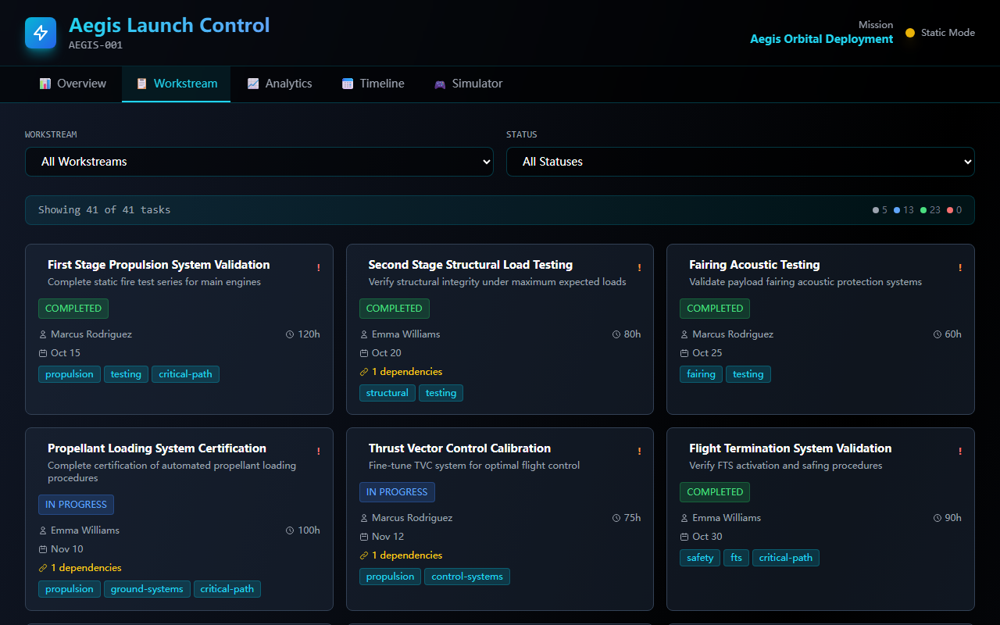
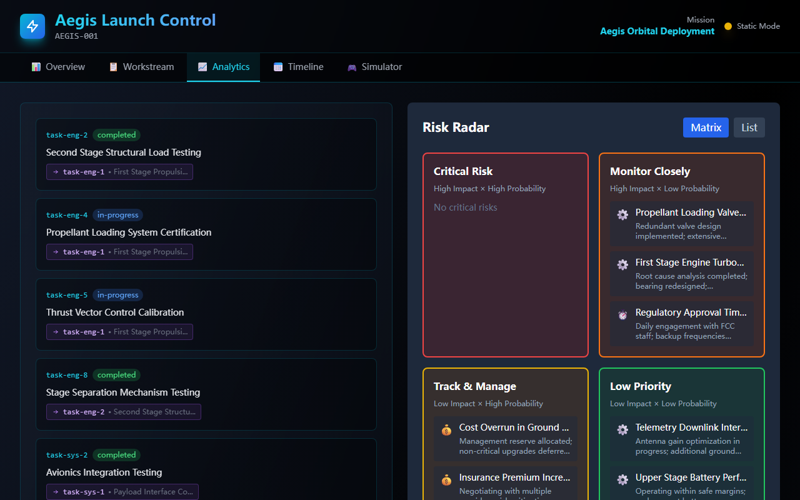
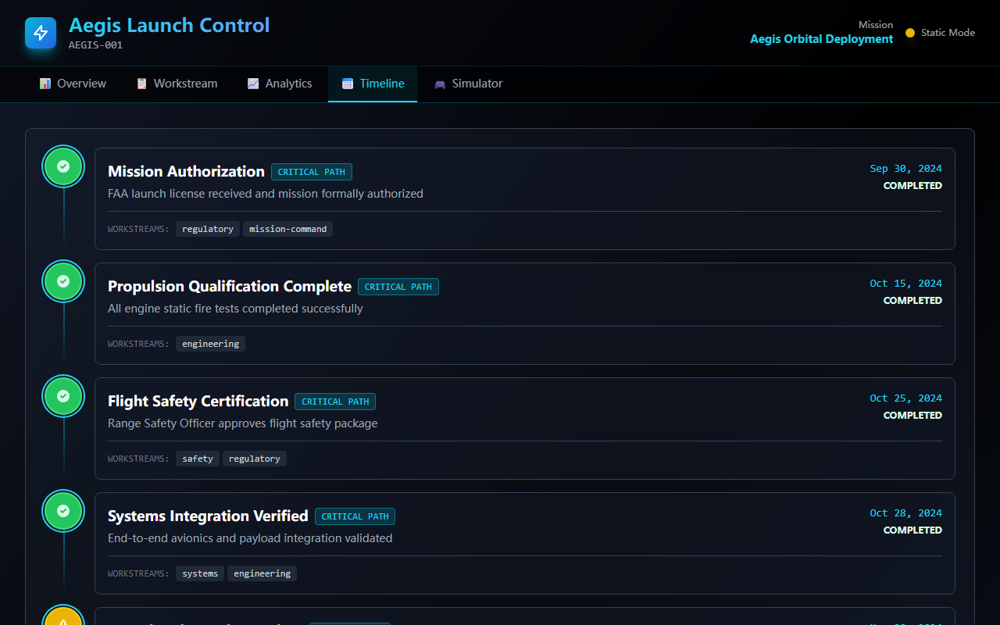

# Aegis Launch Control — built end-to-end by Agent OS

This folder is a **public showcase**: every line of the app under
[`repo/`](./repo) was written **autonomously by the Agent OS Coding Agent**,
starting from a completely empty repository, in response to a single
natural-language task card. No human wrote any of the application code, fixed
its build, or edited its files. It is committed here as a concrete example of
what Agent OS can do today.


*The running app: the Overview tab — launch countdown, readiness gauge,
budget/tasks/risk metrics, and workstream status. This is **Agent OS's own
automated browser-verification capture** (`npm run dev`, frontend-only with the
bundled static-data fallback), taken after the upgraded verification waited for
the app to actually render.*

> **Built by Claude Sonnet 4.5.** The Coding Agent for this run was driven by
> **Claude Sonnet 4.5** — deliberately *not* the strongest model available.
> That a mid-tier model produced a complete, building full-stack app end to end
> makes this a useful *lower bound* on what Agent OS can do; stronger models
> only raise the ceiling.

> Every *other* project and workspace stays private (gitignored). Only this one
> demo is published, and only its source + run evidence — the regenerable
> `node_modules/`, `dist/`, and `logs/` are excluded.

## What got built

A "mission-control" planning dashboard — **React + TypeScript + Vite +
Tailwind** front end plus a **lightweight Express + JSON** back end:

- Six dashboard sections — **Mission Overview**, **Workstream Board**,
  **Dependency Map** (SVG node-edge graph), **Risk Radar** (impact/probability
  matrix), **Launch Timeline**, and an interactive **Scenario Simulator**.
- A realistic seed dataset (a mission, 6 workstreams, 41 tasks with
  dependencies, 15 risks, 8 milestones, 4 scenarios).
- A typed API client (`src/services/api.ts`) that fetches from the Express
  server and falls back to bundled static data when the API is offline.
- Tab navigation, responsive breakpoints, an error boundary, and a cinematic
  dark theme.

**30+ source and config files** under `repo/` (plus the run artifacts below).

## How it was built (the autonomous run)

One task card ([`runs/.../task_card.md`](./runs/20260619-044436-e65d2e61/task_card.md))
went in. Agent OS then, with **no further human input**:

1. **Planned** the work — decomposed the card into an **8-task graph** with
   dependencies (read-only inspection first), persisted as
   [`plan.json`](./runs/20260619-044436-e65d2e61/plan.json).
2. **Executed** the tasks one by one (scaffold → data models → each dashboard
   section → polish → backend API), writing every file through the sandboxed
   tool runtime.
3. **Verified** the result by actually running `npm install` + `npm run build`
   (TypeScript `tsc` + Vite) — **the build passed**, 41 modules transformed —
   with one automated repair pass along the way.
4. **Verified in a browser** — spun up the dev server, **waited for the app to
   actually render** (not a loading spinner), captured the entry view plus each
   tab, and had a **vision model judge** the screenshots (verdict: **passed**).

Outcome: **8 / 8 tasks completed, 0 blockers, production build green.** See the
rendered [`result.md`](./runs/20260619-044436-e65d2e61/result.md) and the full
machine record [`run.json`](./runs/20260619-044436-e65d2e61/run.json).

### Full audit trail

Everything the agent did is replayable from the run artifacts in
[`runs/20260619-044436-e65d2e61/`](./runs/20260619-044436-e65d2e61):

| File | What it is |
|------|------------|
| `task_card.md` | The exact prompt the agent received |
| `plan.json` | The 8-task dependency graph it produced |
| `events.jsonl` | Chronological log of **every** tool call (file write, command, verification step) |
| `result.md` | Human-readable summary + the real `npm run build` log |
| `run.json` | The full structured run record |
| `screenshots/browser.png` (+ `page-02…05.png`) | The automated, readiness-gated **multi-page** browser-verification captures (Overview + each tab) |
| `visual_review.json` | The **AI visual-judgment** verdict over those screenshots |

## What the automated verification captured

Agent OS's browser verification waits for the app to genuinely render, walks its
tabs, and screenshots each — then a vision model judges whether the result looks
correct. These are the captures from this run's verification (all
frontend-only, `npm run dev`, using the bundled static-data fallback):

| Overview | Workstream Board |
|----------|------------------|
|  |  |
| **Analytics — Risk Radar** | **Launch Timeline** |
|  |  |

**AI visual verdict: `passed`** — *"Aegis Launch Control dashboard is fully
functional, visually polished, and meets all core requirements."* The model
cited the populated countdown / readiness / budget / task metrics, the
workstream cards, and the risk-radar matrix as evidence (full record in
[`visual_review.json`](./runs/20260619-044436-e65d2e61/visual_review.json)). The
verdict is **diagnostic only** — it never changes the run's status.

> **Note on an earlier limitation (now fixed).** This automated capture used to
> land on the app's brief *loading* state: single-server preview starts only the
> frontend (`npm run dev`) while the build wired the UI to fetch from a separate
> Express API. Agent OS's browser verification was since upgraded to **wait for a
> real render** (the app falls back to bundled static data when the API is
> offline), to **capture multiple views**, and to **judge the result with a
> vision model** — so the captures above are now the populated dashboard. The
> production build was always green (see the build log in `result.md`).

## Run it yourself

```bash
cd repo
npm install

# Full stack (frontend + Express API on its own port):
npm run dev:all

# …or frontend only (uses the bundled static-data fallback):
npm run dev
```

## Honest caveat

This is **AI-generated demo code**, committed verbatim from the autonomous run
(only `node_modules/` / `dist/` / `logs/` were excluded). It hasn't been
hand-reviewed or hardened for production — it's here to demonstrate Agent OS's
autonomous build capability, end to end, from an empty repo.
